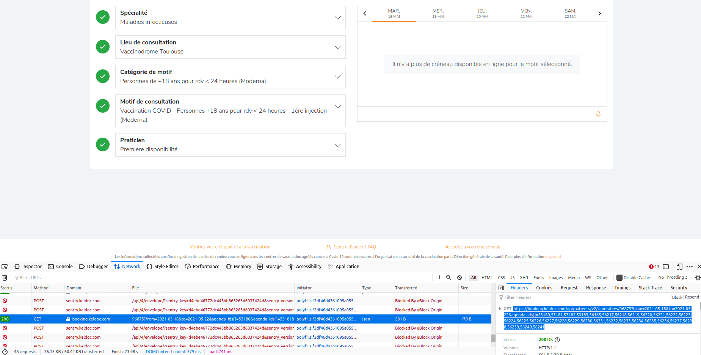
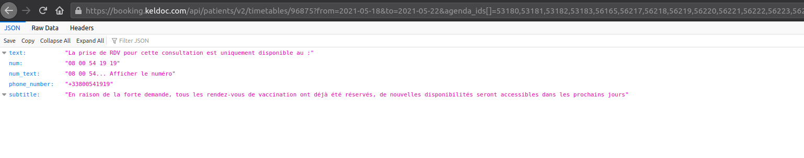

Le script `getmadose.sh` scanne chaque 2 sec la page keldoc d'un centre de vaccination et ouvrira la page approprié dans votre navigateur dès qu'un nouveau rdv est détecté.

Pour l'utiliser il faut le télécharger, aller dans le répertoire, puis lancer `sh getmadose.sh`

Le script a 4 dépendances : curl, grep, xdg-open et jq. Les 3 premières sont par défaut sur Ubuntu, la dernière peut etre installer via `sudo apt install jq` en quelques secondes. Sur Mac je ne sais pas, c'est quasi sûr que c'est possible mais il va falloir vous débrouiller.

Avant ceci, il faut adapter 2 variables à l'intérieur du script à votre besoin précis (i.e. si vous n'habitez pas à Toulouse) : $urltoparse et $urltoopen. Les déterminer est de loin le plus pénible, il faut aller sur la page keldoc du centre et afficher dans les options de Firefox -> Web developer -> cocher Web developer Tools. Le raccourci pour les afficer est CTRL+SHIFT+I sur Linux (doit pas être très loin sur Mac) :

## urltoopen

L'urltoopen est la page qui sera ouverte automatiquement par le script, et devra vous permettre de réserver le créneau qui vient de se libérer le plus rapidement possible. Il m'est arrivé plusieurs fois qu'un nouveau rdv apparaisse, je valide, il faut alors sélectionner un 2eme rdv, mais aucune n'apparait. Ca m'est arrivé 3 fois avant d'avoir finalement sur une autre détection un 2eme rdv qui apparait. Ca doit etre un bug de leur système.

1. aller sur la page du centre voulu
2. sélectionner "Catégorie de motif" puis ""Motif de consultation".
3. clique droit sur ce dernier -> This Frame -> View Frame Info (ceci n'apparait que si vous êtes dans le Web Developer Tools de Firefox)
4. Dans l'onglet Général, copier l'Adresse, c'est votre "urltoopen"

Testez là d'abord : pour ceci il faut la copier dans la barre d'adresse du navigateur, si c'est la bonne elle devrait vous renvoyer la page sur laquelle vous étiez mais directement avec les bonnes cases remplies.


## urltoparse

L'urltoparse est la commande API qui va renvoyer des données au format JSON, lesquels sont ensuite affichées par keldoc. Ce sont ces données que l'on va scanner pour détecter des rdv dispos.



1. aller sur l'onglet Network dans les Web Developer Tools affichés en bas de page, recharger la page et cliquer sur les bons critères, etc. A chaque fois que l'on sélectionne une nouvelle valeur pour un champ, une commande GET est envoyée. Vous pouvez les voir apparaitre dans l'onglet. Si vous ne voyez que des POST et pas de GET. Regarder la page (F5) et vous devriez les voir.
2. prenez la dernière ligne de Method GET, apparue quand vous avez indiqués les bons critères pour vous. En cliquant dessus (simple clique) on obtient une URL de GET qui apparait sur la droite, du type `https://booking.keldoc.com/api/patients/v2/timetables/96875blablabblabla` longue et avec pleins de champs. Ces champs définissent les critères de date (début et fin) et agenda_ids, ça c'est un mystère ce que c'est pour moi mais ça bouge pas on peut les laisser hardcodés comme ça.
3. Cette addresse est votre urltoparse.

Pour la tester, entrer la une nouvelle fois dans votre barre d'adresse, Firefox devrait cette fois retourner un JSON formatté. Un truc comme ça:



## Exemple pour le vaccinodrome de l'Ile du Ramier à Toulouse (par defaut ici dans le script) ça donne ça :

```bash
urltoparse="https://booking.keldoc.com/api/patients/v2/timetables/96875?from=2021-05-18&to=2021-05-22&agenda_ids[]=53180,53181,53182,53183,56165,56217,56218,56219,56220,56221,56222,56223,56224,56225,56226,56227,56228,56229,56230,56231,56232,56233,56234,56235,56236,56237,56238,56239,56240,56241"

urltoopen="https://booking.keldoc.com/cabinet-medical/toulouse-31000/vaccinodrome-toulouse?motive=96875&category=3832&cabinet=18777&specialty=144&agenda=53180,53181,53182,53183,56165,56217,56218,56219,56220,56221,56222,56223,56224,56225,56226,56227,56228,56229,56230,56231,56232,56233,56234,56235,56236,56237,56238,56239,56240,56241"
```
